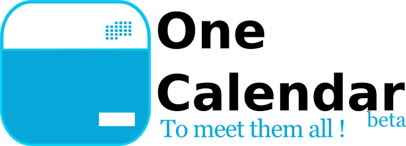

## The problem we solve

Have ever looked for events on a specific subject ?
You had to realize that there were many differents sources, not so well structured, and rarely available directly since your diary. I think about for example [Open Diary](http://www.agendadulibre.org/) [Agile Diary](http://www.agenda-agile.org/), some meetups, [JDuchess Diary](https://sites.google.com/site/duchessfr/calendrier-conferences) and for so much others communities it could exist.
I find rather complex and spend too much time to stay up to date of all the events, and am always warned too late to register.

## What it does

The idea is to simplify all this by proposing a **diaries aggregator**, which is going to tag them, and store it to be able to consult, filter and extract. To start, under the shape of iCal, standard IETF flow, for schedule.

## Benefits

One of the major benefit is to propose a standard format like [iCal](http://www.ietf.org/rfc/rfc2445.txt). By this way, with a minimal web application, and any compatible device, we can propose our service.
We use a NoSQL database to be able to evolve our data model without script migration. We use this NoSQL database to build our categories index.

## Drawbacks

The categorization of the events, the extraction of the tags is like building an index with a very specific dictionary, so we have to build everything to make it work as expected.
Because this dictionary is so specific, we have to build a synonym database.
Those two points are not addressed at the moment.

## High level design

web client that can handle specifically ical url scheme. It consult our web application to filter bellow his tastes. And we deliver him an iCal file that can be refreshed on its terminal. The iCal is generated from the extract with those criteria for the database.
It's a classical web layered application.

* Very classical web client
* Web Server
    * View
    * Controller
    * Service
    * DAO
* Database

# For developers with native dependencies

## To prepare the application

* Have node (> 0.8) installed
* Have play2 (2.2.1) installed somewhere and add it to your path
* Have mongo2 (2.0.6) started (only for run command)
    * create a folder named "data" where the following command is started
    * `mkdir data`
    * `mongod --dbpath ./data --noprealloc --smallfiles --nojournal --rest`
* Retrieve front dependencies with `npm install` (and bower install build-in)

## To prepare tests

### To run front tests
The js tests doesn't compile by themself [for now](http://github.com/ValtechTechno/OneCalendar/issues/53), so to transpile those scripts

* `npm test`
* `npm run-sript compile-tests`

### To run play test

* `play test`

## To launch the application
* Launch the application, as any play app
    * `play`
    * `$ compile`
    * `$ run`

# For developers with Docker

## Prepare dev environment

    `docker build .`
    `./01-run-mongod.sh`
    `./02-run-play.sh`
        then `npm install` to resolve front dependencies
        then `play` to resolve play dependencies
        then `compile` to resolve project dependencies
         
## Run tests

    in play container: see [To prepare tests](#to-prepare-tests)
    
## Launch application

    in play container: see [To launch the application](#to-launch-the-application)
